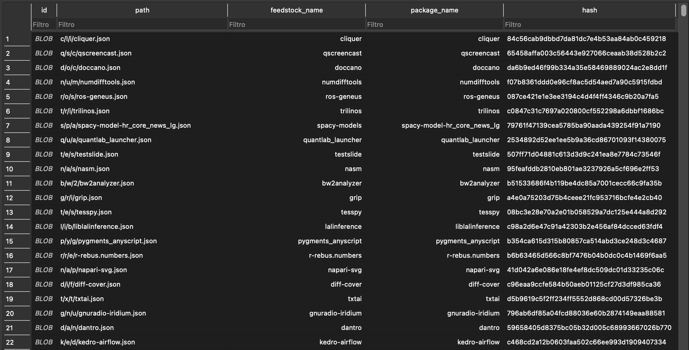
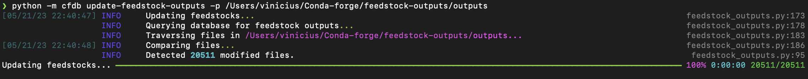
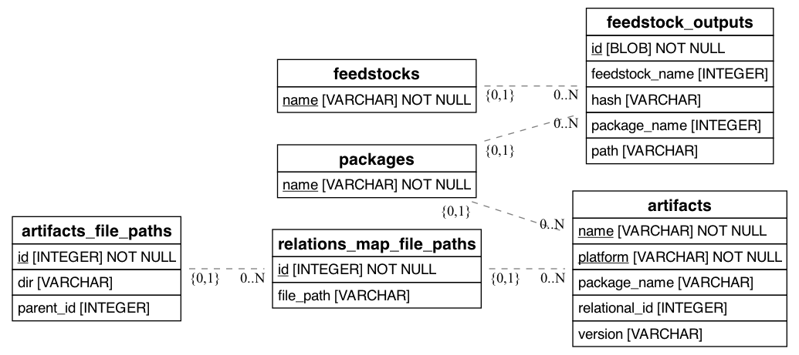

Work in progress as part of the CZI project to migrage conda-forge ecosystem "databases" to a new schema.

# Conda Forge Database (CondaForgeDB)

CFDB is a database management tool for Conda Forge, an open-source community-led collection of recipes, build infrastructure, and distribution artifacts for the conda package manager. CFDB provides functionalities to update and manage the feedstock outputs and artifacts in the Conda Forge database.



## Features

- Update feedstock outputs: CFDB allows you to update the feedstock outputs in the database based on the local path to the feedstock outputs cloned from Conda Forge. This ensures that the database is up to date with the latest feedstock outputs.

- Update artifacts: CFDB provides a functionality to update the artifacts in the database. It ensures that the database contains the most recent artifacts associated with the feedstocks.

## Installation

1. Clone the repository:

2. Build the conda environment associated with the project:

   ```shell
   conda env create -f environment.yml
   ```

## Usage

CFDB provides a command-line interface (CLI) to interact with the database. Here are the available commands:

- `python -m cfdb update-feedstock-outputs`: Update the feedstock outputs in the database based on the local path to the feedstock outputs cloned from Conda Forge.

- `python -m cfdb update-artifacts`: Update the artifacts in the database.

To execute a command, run `python -m cfdb` followed by the desired command. For example, to update the feedstock outputs in the database, run:

```bash
python -m cfdb update-feedstock-outputs -p /path/to/feedstock-outputs/outputs
```



To see the available options for a command, run `python -m cfdb` followed by the desired command and the `--help` flag.


## Configuration

CFDB uses a SQLite database by default (`cf-database.db`). If you need to use a different database, update the database URL in the `CFDBHandler` class located in `cfdb/handler.py`. Keep in mind that the database must be compatible with SQLAlchemy.

## Entity Relationship Diagram



## Contributing

Contributions are welcome! If you have any suggestions, bug reports, or feature requests, please open an issue or submit a pull request.